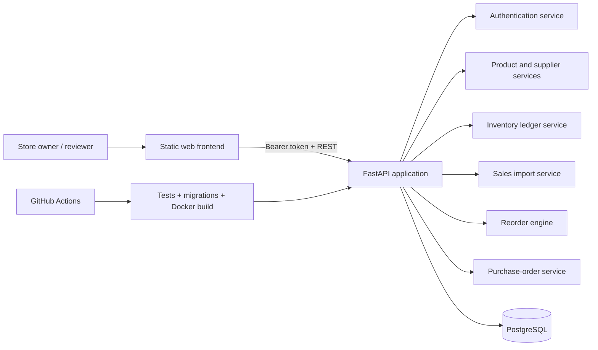
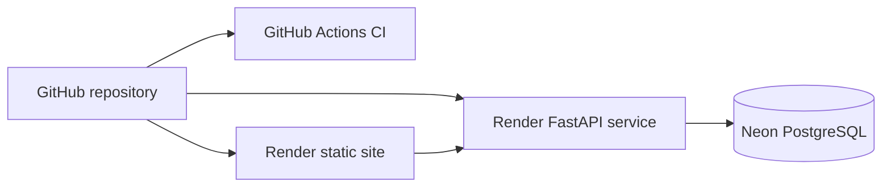

# StoreFlow — Smart Restocking Workflow

[](https://github.com/sakshipatel29/StoreFlow---Smart-Restocking-Workflow/actions/workflows/ci.yml)
[](https://storeflow-smart-restocking-workflow.onrender.com/)
[](https://storeflow-api-0h7y.onrender.com/docs)
[](https://www.python.org/)
[](https://www.postgresql.org/)

**StoreFlow** is a full-stack inventory and purchase-order workflow designed from a real convenience-store ordering problem. It converts product-level sales and inventory activity into explainable restocking recommendations, groups accepted recommendations by supplier, and supports the complete order lifecycle from review through receiving.

The project demonstrates a Forward Deployed Engineering approach: understand an existing manual workflow, work around legacy-system constraints, build an operational solution, make recommendations understandable to a nontechnical user, and deploy the system for real-world evaluation.

## Live demo

**Application:** https://storeflow-smart-restocking-workflow.onrender.com/  
**API documentation:** https://storeflow-api-0h7y.onrender.com/docs

```text
Email:    admin@storeflow.demo
Password: StoreFlowDemo#2026Secure!
```

The account is intentionally public for portfolio review. It is isolated from private database credentials and can reset the demo dataset from the application.

> The backend is hosted on a free service and may take a short time to wake after inactivity.

## The customer problem

A convenience-store owner prepares weekly orders by walking through the store, identifying low-stock products, writing items on separate supplier forms, and relying heavily on memory and visual checks. The existing billing workflow records limited information and does not maintain reliable SKU-level inventory.

This creates several operational problems:

- Repetitive weekly shelf checking and form preparation
- Missed low-stock products
- Over-ordering slow-moving products
- No auditable explanation for inventory changes
- Limited sales history for reorder decisions
- Separate manual workflows for each supplier

## Solution

StoreFlow introduces a gradual workflow that can coexist with a legacy billing system:

```text
Sales CSV or product-level sale
              ↓
Validated sales records
              ↓
Inventory transaction ledger
              ↓
Current stock calculation
              ↓
Explainable reorder recommendations
              ↓
Owner accepts, modifies, or rejects
              ↓
Supplier-specific purchase orders
              ↓
Order approval and delivery receiving
              ↓
Inventory automatically updated
```

The system keeps a human in the loop. It recommends quantities but does not place orders without approval.

## Key features

### Product and supplier management
- Product catalog with SKU, barcode, category, supplier, pricing, case size, safety stock, and lead time
- Supplier directory and supplier-specific order grouping
- Search and filtering across the catalog

### Auditable inventory
- Event-based inventory ledger rather than silently replacing stock totals
- Receiving, sale, damage, expiration, return, and manual-adjustment transactions
- Product-level transaction history
- Current stock calculated from inventory events

### Sales ingestion
- CSV upload and validation
- Barcode-to-product matching
- Unknown-barcode rejection
- Duplicate-import protection
- Automatic sales and negative inventory transactions

### Explainable reorder engine
- Average daily sales from recent history
- Lead-time and safety-stock coverage
- Case-pack rounding
- Human-readable recommendation reasons
- Accept, modify, and reject decisions

### Purchase-order workflow
- Group accepted recommendations by supplier
- Create draft purchase orders
- Approve orders
- Export orders to CSV
- Receive deliveries and update inventory

### Portfolio-ready operations
- Authenticated demo account
- Admin-only demo reset
- FastAPI Swagger documentation
- Alembic database migrations
- Docker Compose local environment
- Automated backend tests
- GitHub Actions CI
- Public frontend, API, and managed PostgreSQL deployment

## Reorder logic

The initial engine intentionally uses transparent business rules rather than opaque machine learning.

```text
Expected demand = average daily sales × coverage days

Target stock = expected demand + safety stock

Required units =
    target stock
    - current stock
    - units already on order

Recommended cases =
    ceil(required units ÷ units per case)
```

Example:

```text
Current stock:          22 units
Average daily sales:     8 units
Coverage period:        10 days
Safety stock:           10 units
Units per case:         24

Target stock = (8 × 10) + 10 = 90
Required units = 90 - 22 = 68
Recommended order = ceil(68 / 24) = 3 cases
```

The UI displays the supporting values so the owner can understand and override the recommendation.

## Architecture



### Deployment



## Technology stack

| Area | Technology |
|---|---|
| Frontend | HTML, CSS, JavaScript |
| Backend | Python 3.12, FastAPI |
| API validation | Pydantic |
| ORM | SQLAlchemy 2 |
| Database | PostgreSQL 17 |
| Migrations | Alembic |
| Authentication | Signed bearer tokens, HS256, scrypt password hashing |
| Data processing | Python CSV processing |
| Testing | Pytest |
| Local infrastructure | Docker, Docker Compose |
| CI | GitHub Actions |
| Deployment | Render, Neon PostgreSQL |

## Demo dataset

The seeded dataset provides a realistic convenience-store environment:

- 4 suppliers
- 48 products
- 4 retail categories
- 4,067 historical sales records
- Inventory receipts and adjustments
- Products with different demand velocities and stock conditions

The dataset is synthetic and safe to publish.

## API areas

```text
POST /api/v1/auth/login
GET  /api/v1/auth/me

GET/POST/PATCH /api/v1/products
GET            /api/v1/suppliers

GET  /api/v1/inventory
POST /api/v1/inventory/receive
POST /api/v1/inventory/adjust

POST /api/v1/sales/import

POST /api/v1/recommendations/generate
GET  /api/v1/recommendations
PATCH /api/v1/recommendations/{id}

POST /api/v1/purchase-orders
POST /api/v1/purchase-orders/{id}/approve
POST /api/v1/purchase-orders/{id}/receive
GET  /api/v1/purchase-orders/{id}/export

GET  /api/v1/analytics/summary
POST /api/v1/demo/reset
```

The complete interactive API reference is available at:

https://storeflow-api-0h7y.onrender.com/docs

## Run locally

### Prerequisites

- Docker Desktop
- Git
- Python 3, only for serving the static frontend

### 1. Clone the repository

```bash
git clone https://github.com/sakshipatel29/StoreFlow---Smart-Restocking-Workflow.git
cd StoreFlow---Smart-Restocking-Workflow
```

### 2. Start the backend

```bash
cd backend
cp .env.example .env
docker compose up --build
```

Local services:

```text
FastAPI:    http://localhost:8001
Swagger:    http://localhost:8001/docs
PostgreSQL: localhost:5434
```

### 3. Start the frontend

Open a second terminal:

```bash
cd frontend
python3 -m http.server 4173
```

Open:

```text
http://localhost:4173
```

For local development, update `frontend/config.js` to use:

```javascript
window.STOREFLOW_CONFIG = {
  apiBase: "http://localhost:8001/api/v1",
};
```

## Run tests

```bash
cd backend
docker compose exec api python -m pytest -q
```

The test suite covers:

- Public health endpoint
- Authentication requirements
- Successful and failed login
- Current-user endpoint
- Inventory updates
- Sales CSV import and invalid barcode handling
- Recommendation-to-purchase-order-to-receiving workflow
- Admin demo reset while preserving user accounts

## Database migrations

```bash
cd backend
docker compose exec api alembic upgrade head
```

Current migration path:

```text
Initial StoreFlow schema
→ Authenticated users
```

## Project structure

```text
.
├── .github/
│   └── workflows/
│       └── ci.yml
├── backend/
│   ├── alembic/
│   ├── app/
│   │   ├── api/
│   │   ├── core/
│   │   ├── db/
│   │   ├── models/
│   │   ├── schemas/
│   │   ├── services/
│   │   └── scripts/
│   ├── data/
│   ├── tests/
│   ├── Dockerfile
│   └── docker-compose.yml
├── frontend/
│   ├── data/
│   ├── app.js
│   ├── config.js
│   ├── index.html
│   └── styles.css
├── docs/
├── render.yaml
└── README.md
```

## Forward Deployed Engineering decisions

| Customer constraint | Engineering decision |
|---|---|
| Existing billing system cannot immediately be replaced | Support CSV ingestion and gradual integration |
| Owner needs control over ordering | Human approval before purchase-order creation |
| Inventory counts may be imperfect | Event ledger plus manual adjustments |
| Suppliers use case quantities | Round recommendations to full cases |
| Recommendations must be trusted | Show the reason and supporting values |
| Portfolio reviewers need repeatable data | Admin-only demo reset |
| Deployment should remain inexpensive | Static frontend, managed API, managed PostgreSQL |

## Suggested pilot plan

The deployed application is pilot-ready. A real store evaluation should begin with one category and one supplier.

1. Record the current weekly ordering time.
2. Import or record product-level sales for the pilot category.
3. Run the manual and StoreFlow processes in parallel.
4. Compare recommended orders with the owner’s order.
5. Track owner modifications and reasons.
6. Measure stockouts, count differences, and ordering time.
7. Expand only after the results are reliable.

Do not claim measured impact until these results have been collected.

## Roadmap

- Direct Square, Clover, or Lightspeed POS integration
- Barcode-scanner checkout companion
- Supplier email delivery
- Partial receiving and back-order support
- Forecast confidence and anomaly detection
- Expiration-date and batch tracking
- Multiple stores and role-based access
- Observability, rate limiting, and audit-log improvements

## Security note

The published credentials are for the isolated portfolio demo only. Never commit or publish:

- Neon database credentials
- `AUTH_SECRET_KEY`
- private production account passwords
- deployment access tokens

## Author

**Sakshi Patel**

- GitHub: https://github.com/sakshipatel29
- Live project: https://storeflow-smart-restocking-workflow.onrender.com/

---

Built as a customer-centered full-stack engineering project focused on operational workflow improvement, explainability, and deployment.
